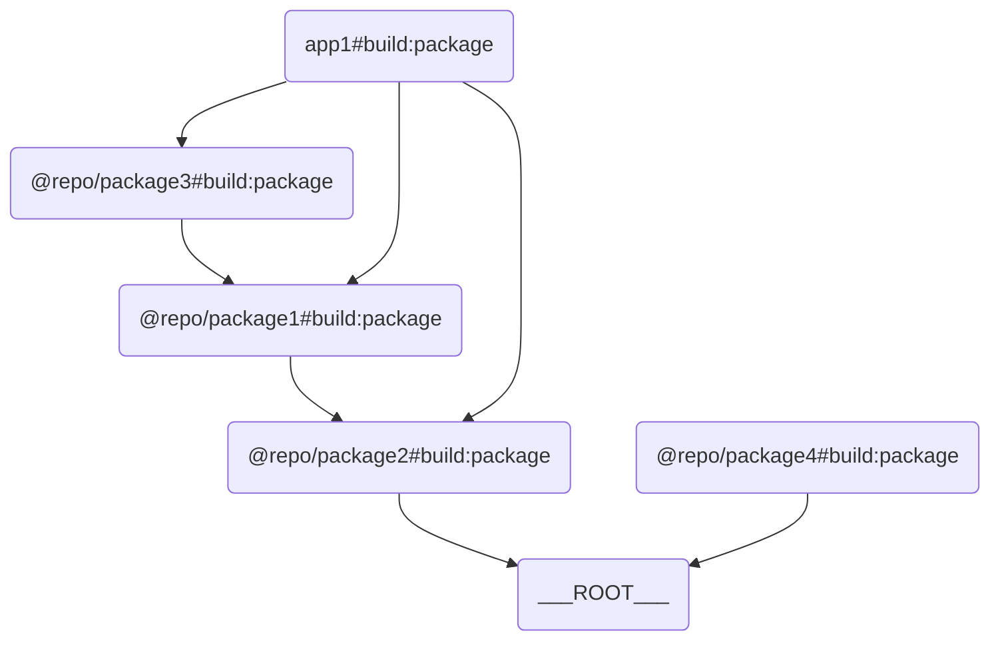

# turborepo-test

Install dependencies

```bash
bun install
```

Then try to run
```bash
bunx turbo build:package
```

Then try to run
```bash
bunx turbo deploy
```

You will notice that the packages are correctly built in the order according to their dependencies

